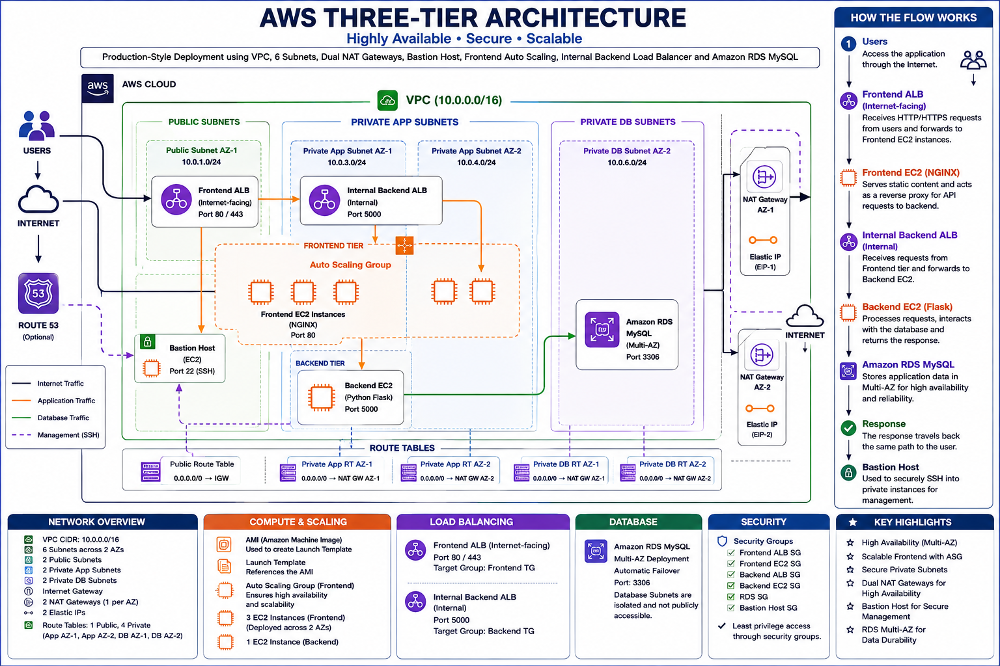
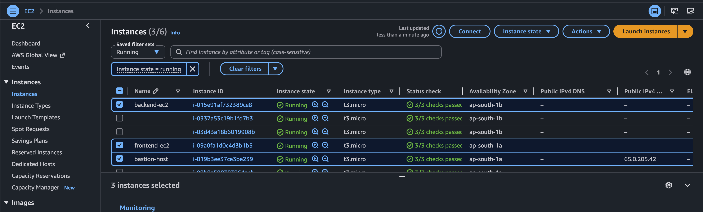
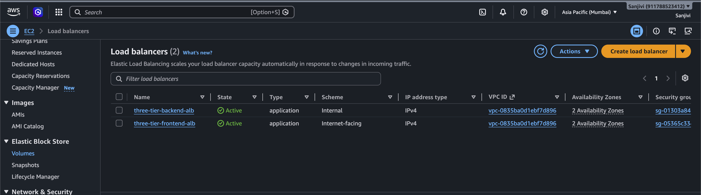
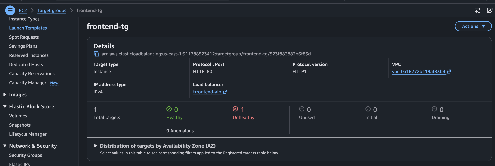
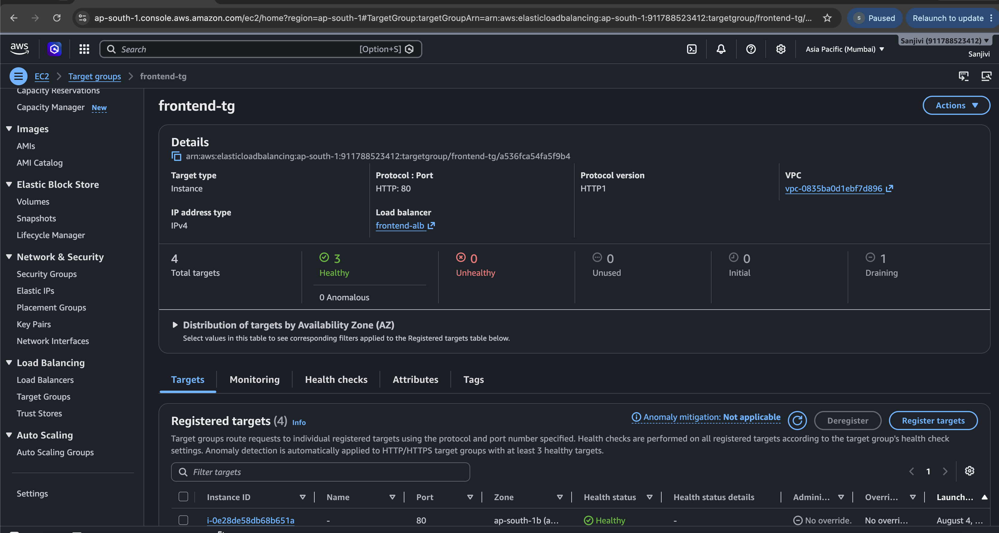
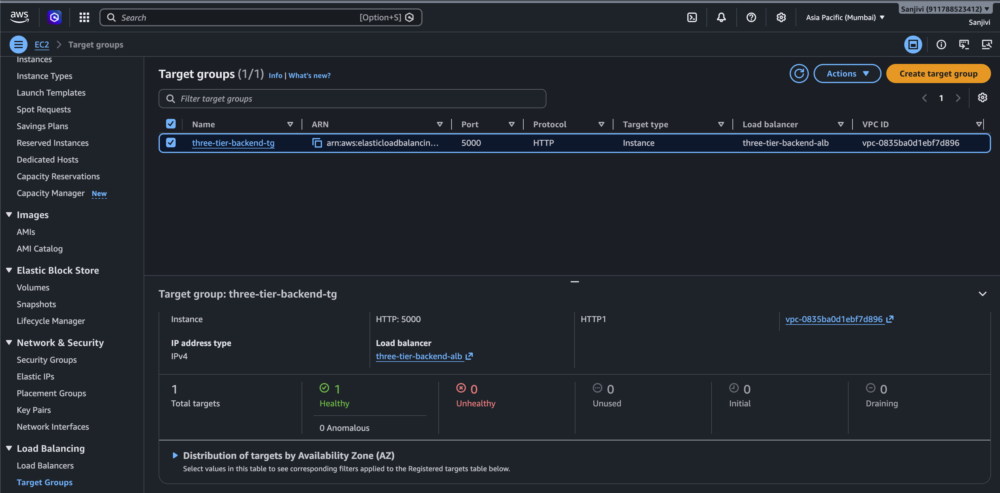
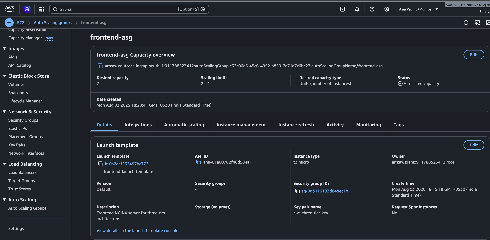
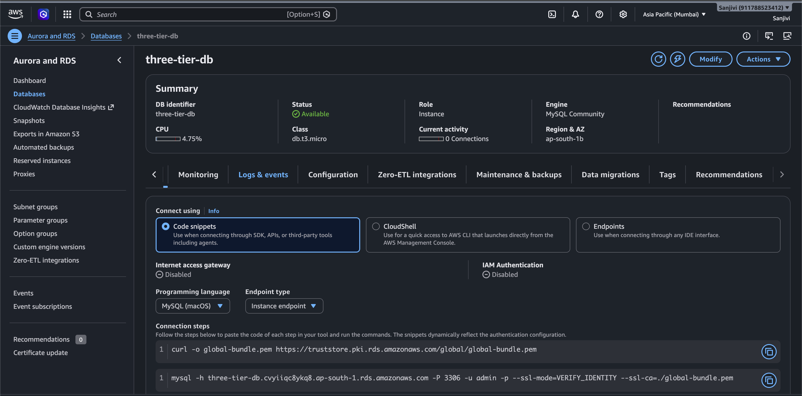
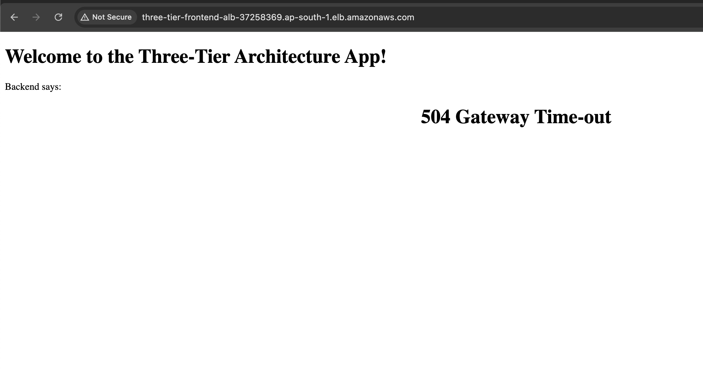
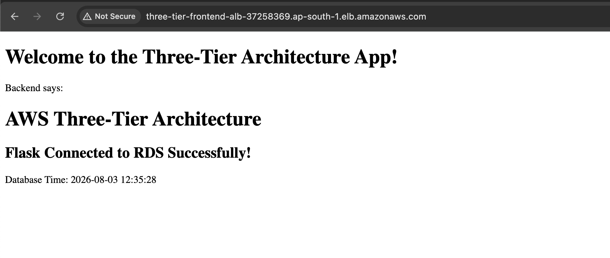

# AWS Three-Tier Architecture on AWS

## Project Overview

This project demonstrates the design and deployment of a secure, scalable, and production-style **Three-Tier Architecture on AWS**.

The application is divided into three layers:

* **Presentation Tier** – Frontend EC2 running NGINX
* **Application Tier** – Backend EC2 running Python Flask
* **Data Tier** – Amazon RDS MySQL

The architecture uses **Amazon VPC**, **public and private subnets**, **Application Load Balancers (ALB)**, **Launch Templates**, **Auto Scaling Groups (ASG)**, and **Amazon RDS MySQL** to build a highly available web application.

---

# Architecture Diagram



---

# Architecture Flow

```text
                    Users
                      │
                      ▼
      Internet-Facing Application Load Balancer
                      │
                      ▼
             Frontend EC2 (NGINX)
                      │
                      ▼
         NGINX Reverse Proxy (/api)
                      │
                      ▼
     Internal Backend Application Load Balancer
                      │
                      ▼
          Backend EC2 (Python Flask)
                      │
                      ▼
              Amazon RDS MySQL
```

---

# Project Highlights

* Designed and deployed a production-style AWS Three-Tier Architecture.
* Configured secure networking using Amazon VPC.
* Implemented public and private subnet architecture.
* Configured NGINX Reverse Proxy for backend API communication.
* Deployed a Python Flask application on Amazon EC2.
* Connected the backend application with Amazon RDS MySQL.
* Implemented Application Load Balancers and Target Groups.
* Configured Launch Templates and Auto Scaling Groups.
* Performed troubleshooting for networking, load balancing, and backend connectivity.

---

# How It Works

1. Users access the application through the Frontend Application Load Balancer.
2. The Frontend ALB forwards incoming requests to the Frontend EC2 instance.
3. NGINX serves the frontend web application.
4. API requests are forwarded through the `/api` reverse proxy to the Internal Backend ALB.
5. The Backend ALB routes requests to the Backend EC2 instance running the Flask application.
6. The Flask application processes the request and communicates with Amazon RDS MySQL.
7. Amazon RDS returns the requested data.
8. The response is sent back through the backend, frontend, and finally displayed in the user's browser.

---

# AWS Services Used

* Amazon VPC
* Public Subnets
* Private Subnets
* Internet Gateway
* NAT Gateway
* Route Tables
* Security Groups
* Bastion Host
* Amazon EC2
* Application Load Balancer (ALB)
* Target Groups
* Launch Template
* Auto Scaling Group
* Amazon RDS MySQL
* Amazon Machine Image (AMI)

---

# Application Stack

## Frontend

* HTML
* NGINX

## Backend

* Python
* Flask
* PyMySQL

## Database

* Amazon RDS MySQL

---

# Repository Structure

```text
aws-three-tier-architecture/
│
├── frontend/
│   ├── index.html
│   └── nginx.conf
│
├── backend/
│   ├── app.py
│   └── requirements.txt
│
├── database/
│   └── schema.sql
│
├── screenshots/
│   ├── architecture-diagram.png
│   ├── 01-vpc-resource-map.png
│   ├── 02-security-groups.png
│   ├── 03-ec2-instances.png
│   ├── 04-application-load-balancer.png
│   ├── 05-frontend-target-unhealthy.png
│   ├── 06-frontend-tg-asg-healthy.png
│   ├── 07-backend-tg-healthy.png
│   ├── 08-auto-scaling-group.png
│   ├── 09-amazon-rds-database.png
│   ├── 10-backend-504-bad-gateway-error.png
│   └── 11-application-working-output.png
│
└── README.md
```

---

# Features

* Three-Tier Architecture
* Secure Network Design
* Public and Private Subnets
* Application Load Balancer
* Auto Scaling Group
* Launch Template
* Amazon RDS MySQL Integration
* NGINX Reverse Proxy
* Python Flask Backend

---

# NGINX Reverse Proxy Configuration

```nginx
location /api/ {
    proxy_pass http://BACKEND_ALB_DNS:5000/;
    proxy_set_header Host $host;
    proxy_set_header X-Real-IP $remote_addr;
    proxy_set_header X-Forwarded-For $proxy_add_x_forwarded_for;
}
```

> **Note:** Replace `BACKEND_ALB_DNS` with your actual Backend ALB DNS before deployment.

---

# What I Learned

* Designed and deployed a complete AWS Three-Tier Architecture.
* Created a custom Amazon VPC.
* Configured Public and Private Subnets.
* Configured Internet Gateway and NAT Gateway.
* Created Route Tables.
* Configured Security Groups.
* Used a Bastion Host to securely access private EC2 instances.
* Deployed a Python Flask application on Amazon EC2.
* Configured NGINX as a Reverse Proxy.
* Connected Flask with Amazon RDS MySQL.
* Configured Application Load Balancers and Target Groups.
* Created Launch Templates.
* Configured Auto Scaling Groups.
* Improved troubleshooting skills related to networking, load balancing, and application deployment.

---

# Troubleshooting and Fixes

## 1. Backend Target Group Unhealthy

**Issue**

Backend EC2 instances failed ALB health checks.

**Fix**

* Verified Flask was running on port **5000**.
* Corrected Security Group rules.
* Updated Target Group health check configuration.

---

## 2. Backend 504 Gateway Timeout

**Issue**

NGINX returned a **504 Gateway Timeout** because it could not communicate with the backend application.

**Fix**

* Verified the Flask application was running.
* Updated the NGINX Reverse Proxy configuration.
* Corrected the Backend ALB DNS.
* Verified backend connectivity using `curl`.
* Confirmed the Backend Target Group became healthy.

---

## 3. Bastion Host SSH Access

**Issue**

Unable to connect to private EC2 instances using SSH.

**Fix**

* Corrected Security Group rules.
* Successfully connected through the Bastion Host.

---

## 4. Amazon RDS Connection Failed

**Issue**

The Flask application failed to connect to Amazon RDS MySQL.

**Fix**

* Verified the RDS endpoint.
* Corrected the database credentials.
* Allowed MySQL port **3306** in the RDS Security Group.

---

## 5. Auto Scaling Group Instances Unhealthy

**Issue**

Instances launched by the Auto Scaling Group were unhealthy.

**Fix**

* Updated the Launch Template.
* Corrected the User Data script.
* Verified Target Group health checks.

---

# Project Screenshots

## 1. VPC Resource Map


---

## 2. Security Groups


---

## 3. EC2 Instances



---

## 4. Application Load Balancer



---

## 5. Frontend Target Group Unhealthy



---

## 6. Frontend Target Group Healthy



---

## 7. Backend Target Group Healthy



---

## 8. Auto Scaling Group



---

## 9. Amazon RDS MySQL



---

## 10. Backend 504 Gateway Timeout Troubleshooting



---

## 11. Application Working Output



---

# Future Improvements

* Configure HTTPS using AWS Certificate Manager (ACM).
* Integrate Amazon Route 53 with a custom domain.
* Implement Infrastructure as Code (IaC) using Terraform.
* Add AWS Systems Manager (SSM) for EC2 management.
* Protect the application using AWS WAF.
* Store database credentials securely using AWS Secrets Manager.

---

# Author

**Sushma**

Aspiring Cloud & Devops Engineer 


