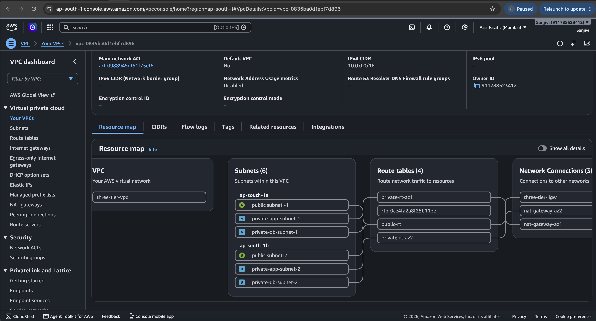
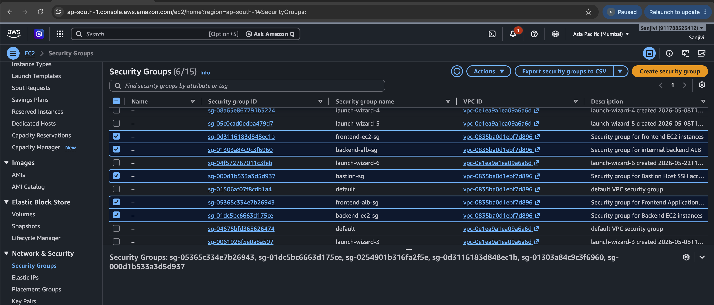

# AWS Three-Tier Architecture on AWS

## Project Overview

This project demonstrates the design and deployment of a secure, scalable, and highly available Three-Tier Architecture on AWS.

The application is divided into three layers:

- **Presentation Tier** – Frontend EC2 running NGINX
- **Application Tier** – Backend EC2 running Python Flask
- **Data Tier** – Amazon RDS MySQL

The architecture uses Amazon VPC, public and private subnets, Application Load Balancers (ALB), Launch Templates, Auto Scaling Groups (ASG), and Amazon RDS to build a production-style web application.

---

# Architecture Flow

```text
                    Users
                      │
                      ▼
     Internet-Facing Application Load Balancer
                      │
                      ▼
           Frontend EC2 (NGINX)
                      │
                      ▼
         NGINX Reverse Proxy (/api)
                      │
                      ▼
 Internal Backend Application Load Balancer
                      │
                      ▼
        Backend EC2 (Python Flask)
                      │
                      ▼
             Amazon RDS MySQL
```

---

# How It Works

1. Users access the application through the Frontend Application Load Balancer.
2. The Frontend ALB forwards requests to the Frontend EC2 instance running NGINX.
3. NGINX serves the frontend web application.
4. API requests are forwarded to the Backend ALB using the `/api` reverse proxy.
5. The Backend ALB routes requests to the Backend EC2 instance.
6. The Flask application processes the request.
7. Flask connects to Amazon RDS MySQL to retrieve or store data.
8. The response is returned through the Backend ALB, Frontend EC2, and Frontend ALB back to the user.

---

# AWS Services Used

- Amazon VPC
- Public Subnets
- Private Subnets
- Internet Gateway
- NAT Gateway
- Route Tables
- Security Groups
- Bastion Host
- Amazon EC2
- Application Load Balancer (ALB)
- Target Groups
- Launch Template
- Auto Scaling Group
- Amazon RDS MySQL

---

# Tech Stack

- AWS
- Python
- Flask
- HTML
- NGINX
- MySQL

---

# Application Stack

## Frontend

- HTML
- NGINX

## Backend

- Python
- Flask
- PyMySQL

## Database

- Amazon RDS MySQL

---

# Repository Structure

```text
aws-three-tier-architecture/

├── frontend/
│   ├── index.html
│   └── nginx.conf
│
├── backend/
│   ├── app.py
│   └── requirements.txt
│
├── database/
│   └── schema.sql
│
├── screenshots/
│
└── README.md
```

---

# Features

- Three-Tier Architecture
- Public and Private Subnet Design
- High Availability
- Application Load Balancing
- Auto Scaling
- Secure Network Architecture
- NGINX Reverse Proxy
- Python Flask Backend
- Amazon RDS MySQL Integration

---

# Deployment Status

- Frontend deployed on Amazon EC2 using NGINX.
- Backend deployed on Amazon EC2 using Python Flask.
- Database hosted on Amazon RDS MySQL.
- Frontend and Backend connected through Application Load Balancers.
- Successfully verified end-to-end application connectivity.

---

# NGINX Reverse Proxy Configuration

```nginx
location /api/ {
    proxy_pass http://BACKEND_ALB_DNS:5000/;
    proxy_set_header Host $host;
    proxy_set_header X-Real-IP $remote_addr;
    proxy_set_header X-Forwarded-For $proxy_add_x_forwarded_for;
}
```

> Replace `BACKEND_ALB_DNS` with your Backend Application Load Balancer DNS name before deployment.

---

# What I Learned

- Designed and deployed an AWS Three-Tier Architecture.
- Created and configured an Amazon VPC.
- Configured Public and Private Subnets.
- Configured Internet Gateway and NAT Gateway.
- Created Route Tables.
- Configured Security Groups.
- Used a Bastion Host to securely access private EC2 instances.
- Deployed a Python Flask application.
- Configured NGINX as a reverse proxy.
- Connected Flask with Amazon RDS MySQL.
- Configured Application Load Balancers and Target Groups.
- Created Launch Templates.
- Configured Auto Scaling Groups.
- Improved troubleshooting skills for networking, load balancing, and application deployment.

---

# Troubleshooting and Fixes

## 1. Backend Target Group Unhealthy

**Issue**

Backend EC2 instances failed Application Load Balancer health checks.

**Fix**

- Verified Flask application was running on port 5000.
- Corrected Security Group rules.
- Updated Target Group health check configuration.

---

## 2. Backend Bad Gateway

**Issue**

The frontend displayed a **502 Bad Gateway** because NGINX could not communicate with the backend application.

**Fix**

- Verified the backend Flask application was running.
- Updated the NGINX reverse proxy configuration.
- Corrected the Backend ALB DNS.
- Verified backend connectivity using `curl`.
- Confirmed the Backend Target Group became healthy.

---

## 3. Bastion Host SSH Access

**Issue**

Unable to connect to private EC2 instances using SSH.

**Fix**

- Corrected Security Group rules.
- Successfully connected through the Bastion Host.

---

## 4. Amazon RDS Connection Failed

**Issue**

The Flask application failed to connect to Amazon RDS MySQL.

**Fix**

- Verified the RDS endpoint.
- Corrected database credentials.
- Allowed MySQL port (3306) in the RDS Security Group.

---

## 5. Auto Scaling Group Instances Unhealthy

**Issue**

Instances launched by the Auto Scaling Group were unhealthy.

**Fix**

- Updated the Launch Template.
- Corrected the User Data script.
- Verified Target Group health checks.

---

# Project Screenshots

## 1. AWS Three-Tier Architecture


---

## 2. VPC Resource Map



---

## 3. Security Groups



---

## 4. EC2 Instances


---

## 5. Frontend Application Load Balancer


---

## 6. Backend Application Load Balancer


---

## 7. Frontend Target Group Healthy


---

## 8. Backend Target Group Healthy


---

## 9. Launch Template


---

## 10. Auto Scaling Group


---

## 11. Backend Bad Gateway Troubleshooting


---

## 12. Application Working Output


---

# Future Improvements

- Configure HTTPS using AWS Certificate Manager (ACM).
- Integrate Amazon Route 53 with a custom domain.
- Implement Infrastructure as Code using Terraform.
- Add AWS Systems Manager (SSM) for EC2 management.
- Protect the application using AWS WAF.
- Store database credentials securely using AWS Secrets Manager.

---

# Author

**Sushma**

AWS Cloud | DevOps Enthusiast
